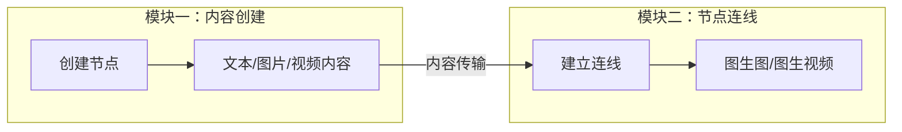
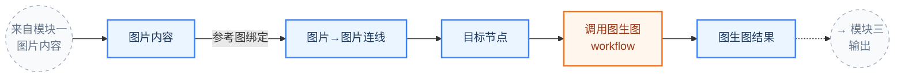

# Mermaid 流程图生成

## 你要做什么

将用户的 PRD 文档、功能描述、或口头需求转化为**清晰可读的 Mermaid 流程图**。
输出 Mermaid 代码块，用户可以直接复制到 mermaid.live 或任何支持 Mermaid 的编辑器中渲染。

## 图表方向

默认使用 `graph LR`（从左到右），与大多数产品流程的阅读习惯一致。
如果流程层级很深而分支不多，可以用 `graph TD`（从上到下）。

## 颜色系统

用 `classDef` + `class` 统一管理节点样式，不同颜色代表不同角色：

```
classDef blue fill:#EBF5FF,stroke:#3B82F6,stroke-width:2px,color:#1E3A5F
classDef orange fill:#FFF7ED,stroke:#F97316,stroke-width:2px,color:#9A3412
classDef green fill:#ECFDF5,stroke:#10B981,stroke-width:2px,color:#065F46
classDef iface fill:#F8FAFC,stroke:#94A3B8,stroke-width:1px,stroke-dasharray:5 5,color:#64748B
```

| 颜色 | 用途 | 示例 |
|------|------|------|
| 🔵 蓝色 (blue) | 用户操作 / 数据状态 / 页面 | "输入 Prompt"、"图片内容"、"进入编辑器" |
| 🟠 橙色 (orange) | 系统处理 / AI workflow / 后台任务 | "调用 AI 文生图 workflow"、"积分扣除" |
| 🟢 绿色 (green) | 基础设施 / 系统服务 / 全局模块 | "积分系统"、"权限校验"、"消息队列" |
| ⚪ 灰色虚线 (iface) | 模块间接口 / 跨图引用节点 | "→ 见图二"、"来自图一" |

## 节点命名

- 使用 `["中文标签"]` 方括号方框（默认）
- 接口节点使用 `(("中文标签"))` 双括号圆形
- 节点 ID 用英文缩写，标签用中文：`I4["图片内容"]`
- 标签内换行用 `\n`：`I2["输入 Prompt\n配置模型、比例、分辨率"]`

## 连线标注

- 普通连线：`A --> B`
- 带标注的连线：`A -->|"标注文字"| B`
- 虚线连线（弱关联/回流）：`A -.-> B` 或 `A -.->|"复用"| B`
- 点线连线（附属关系）：`A -.- B` 或 `A -.-|"积分扣除"| B`

## 复杂度控制

这是最重要的原则：**一张图不超过 20 个节点**。超过就拆分。

### 何时拆分

- 单张图节点数 > 20：必须拆分
- 流程包含 3 个以上独立阶段：建议拆分
- 用户说"太乱了"：拆分

### 如何拆分

1. **总览图**：用 subgraph 展示各模块关系，每个模块内只放 2-3 个核心节点
2. **模块图**：每个模块展开为独立的详细图
3. **接口节点**：模块图之间用灰色虚线圆形节点互相引用





### 拆分后的输出格式

每张图之前加标题和说明：

```
## 图零：模块总览
> 展示各模块关系与数据流向

(mermaid 代码)

---

## 图一：内容创建
> 对应 PRD：xxx、yyy

(mermaid 代码)
```

最后附一张**模块关系总结表**：

| 图 | 模块 | 输出接口 |
|---|------|---------|
| 图零 | 总览 | — |
| 图一 | 内容创建 | 文本/图片/视频内容 → 图二 |
| 图二 | 节点连线 | 生成结果 → 图三 |

## 工作流程

1. **理解内容**：先读取用户提到的 PRD 文档或功能描述，理清核心流程和模块关系
2. **判断复杂度**：预估节点数，决定单图还是拆分
3. **画草稿**：先确定主线流程（最长的那条从左到右的路径），再补充分支
4. **上色分类**：给每个节点分配颜色角色
5. **输出**：Mermaid 代码块 + 简要说明

## 常见图表类型

### 用户使用流程图（最常见）
从入口到完成任务的完整链路。主线从左到右，分支向下展开。

### 状态流转图
适合有明确状态机的场景（如订单状态、任务状态）。用 `stateDiagram-v2`。

### 数据流向图
展示数据在系统各模块间的流动。强调"什么数据"从"哪里"到"哪里"。

### 模块关系图
展示系统架构中各模块的依赖和调用关系。subgraph 分组 + 箭头标注调用方向。

## 语言

- 节点标签使用**中文**
- 连线标注使用**中文**
- 注释可以用中英文
- classDef 等语法关键字保持英文

## 注意事项

- subgraph 标题用 `["中文标题"]` 格式
- 避免连线交叉过多——如果交叉严重，调整节点顺序或拆分子图
- 每张图末尾都要有 classDef + class 样式定义（Mermaid 不支持跨图共享样式）
- 不要在节点标签中使用特殊字符（`<>{}` 等），会导致渲染失败
- 如果用户提供了参考图（截图），尽量匹配其布局风格和信息密度
